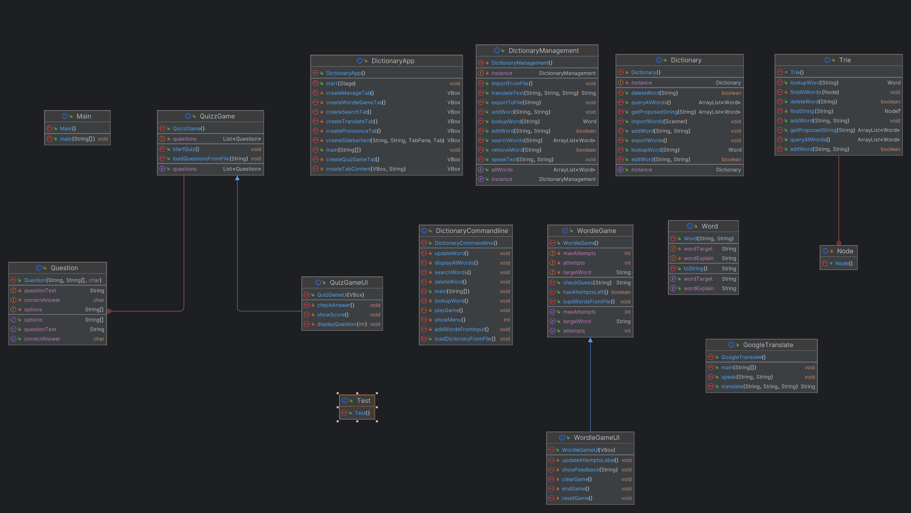

# DictionaryApp

Bài tập lớn môn Lập trình hướng đối tượng (INT2204 1)

# Thành viên
- Trần Hữu Hoàng - 23021564

# Giới thiệu
- Ứng dụng từ điển cho phép người dùng tra cứu và học từ vựng tiếng Anh một cách nhanh chóng và hiệu quả. Nó cũng bao gồm các trò chơi để người học thư giãn sau những giờ học căng thẳng.
- Ứng dụng này được viết bằng ngôn ngữ Java và sử dụng thư viện JavaFX để tạo ra giao diện đồ họa hấp dẫn và đẹp mắt.

## Nội dung
- [Chức năng](#Chức-năng)
    - [Sử dụng từ điển](#Sử-dụng-từ-điển)
    - [Dịch thuật](#Dịch-thuật)
    - [Trò chơi](#Trò-chơi)
- [Công nghệ sử dụng](#Công-nghệ-sử-dụng)
    - [JavaFX](#JavaFX)
    - [Google Translate API](#Google-Translate-API)
    - [Trie](#Trie)

# Chức năng
## Sử dụng từ điển
- Tra cứu từ vựng tiếng Anh: phát âm, từ loại, nghĩa, từ đồng nghĩa, trái nghĩa.
- Thêm/sửa/xóa từ vựng.
- Nghe phát âm của từ vựng.

## Dịch thuật
- Sử dụng API của Google Translate để dịch từ vựng, câu văn, và có thể phát âm một từ hoặc cả một đoạn văn.

## Trò chơi
- Ứng dụng từ điển không chỉ giúp người học giải trí qua các trò chơi mà còn cung cấp một cách học từ vựng hiệu quả và thú vị.
- Những trò chơi này được thiết kế để giảm bớt căng thẳng sau những giờ học tập căng thẳng, đồng thời tăng cường khả năng ghi nhớ từ vựng.

- App bao gồm 2 game:
    * Trắc nghiệm (Quizz)
    * Tìm từ (Wordle)

# Công nghệ sử dụng
## JavaFX
- Sử dụng JavaFX để tạo giao diện đồ hoạ cho ứng dụng (giao diện được thiết kế thông qua file css).
## Google Translate API
- Sử dụng Google Translate API để dịch thuật và phát âm.
## Trie
- Sử dụng cấu trúc dữ liệu Trie để lưu trữ từ điển.
- Trie còn được sử dụng để tìm kiếm/sửa/xóa từ vựng với tốc độ nhanh chóng.
## Cây kế thừa của từ điển

